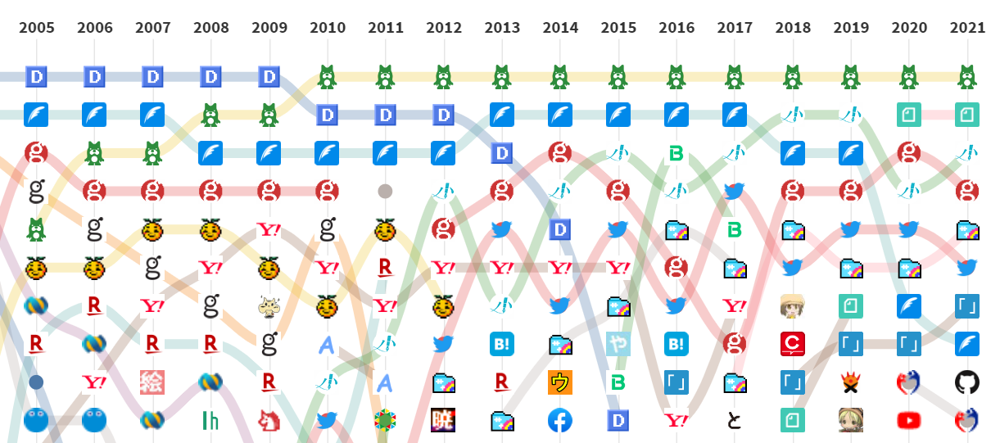

# はてなアンテナの登録ドメイン数の推移

[はてなアンテナは 20 周年を迎えました](https://labo.hatenastaff.com/entry/antenna-20th) に掲載されていた、年ごとの登録ドメイン数の推移をグラフにしてみました。



[全体のグラフはこちらで公開](https://share.streamlit.io/kambara/antenna-domain-ranking/main.py) しています。

## インストール

```
pipenv install
```

## 起動

```
streamlit run main.py
```
